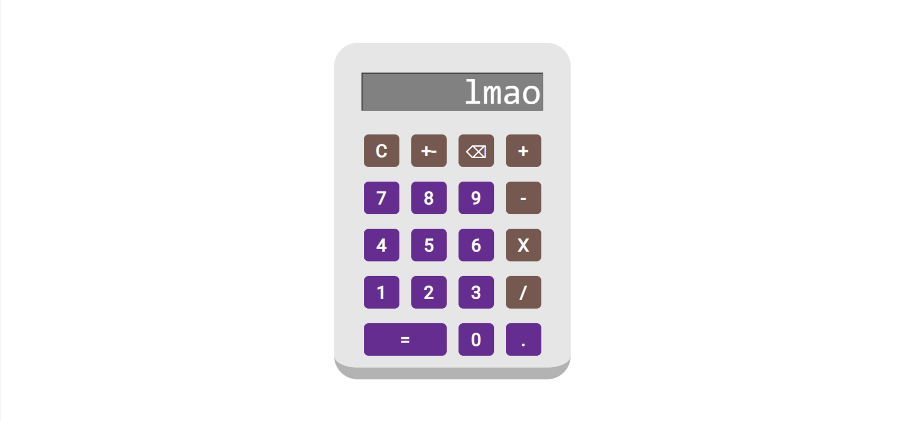

# Calculator

Calc-U-Later: A User-Friendly Simple Calculator

**[Calc-U-Later](https://rainierxcode.github.io/Calculator/)** is a straightforward calculator developed using HTML, CSS, and JavaScript. This easy-to-use calculator is equipped to perform calculations using arithmetic operators and offers the following **features**:

* **Undo Functionality:** Users can easily undo the selection of a number, allowing for quick adjustments.

* **Positive-Negative Switch:** The calculator provides a convenient method to toggle between positive and negative numbers, simplifying number manipulation.

* **Multiple Operator Handling:** Calc-U-Later seamlessly manages calculations involving multiple operators, enhancing its versatility for various mathematical tasks.

* **Error Handling:** Built-in error handling ensures a smooth calculation experience even in challenging scenarios.

Give Calc-U-Later a try for hassle-free and efficient calculations!

## Future Enhancements:

* **Parentheses for PEMDAS:** Planned enhancement to incorporate parentheses support for complex calculations.

  
* **Percentage Calculation:** Future addition of percentage calculation capability.

  
* **Scientific Calculator:** Aspire to transform Calc-U-Later into a comprehensive scientific calculator.

